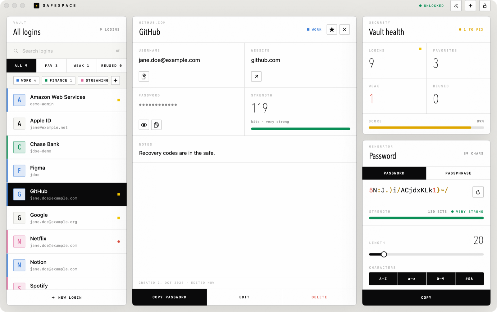
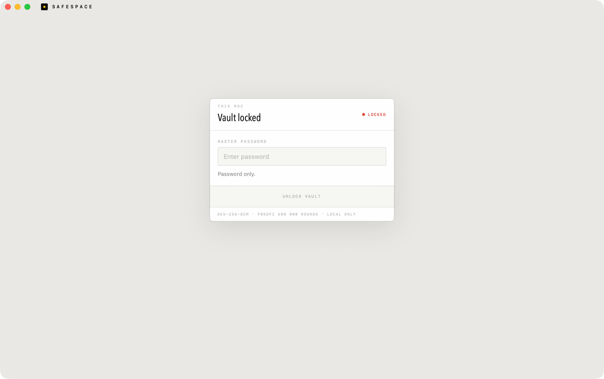
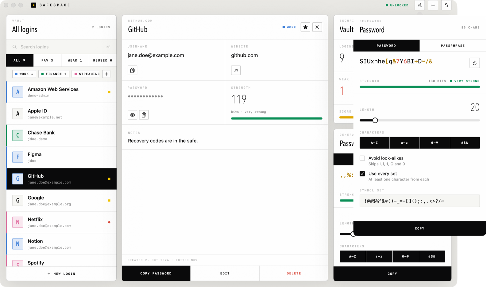
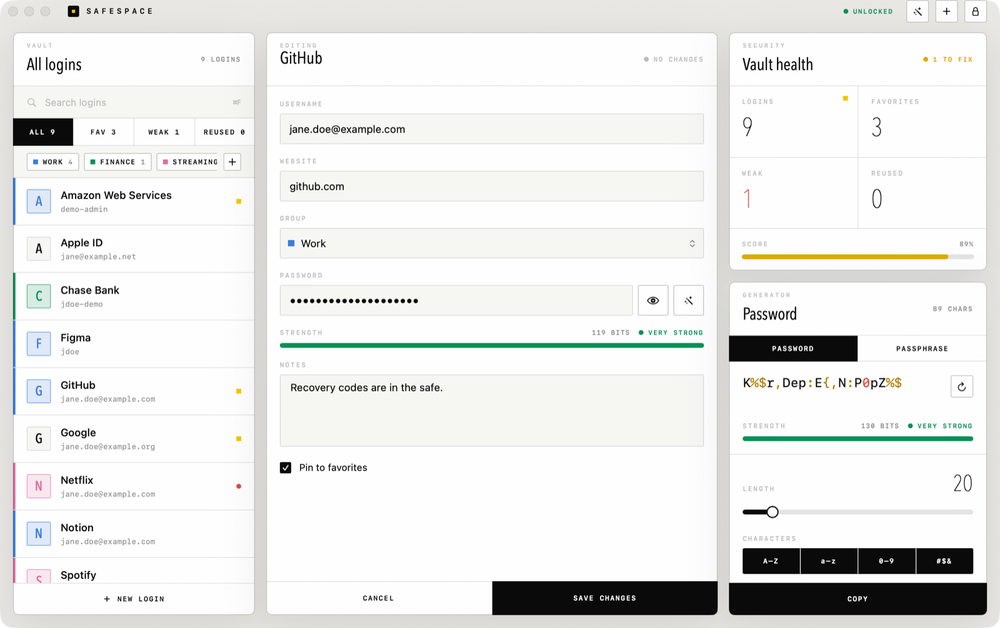
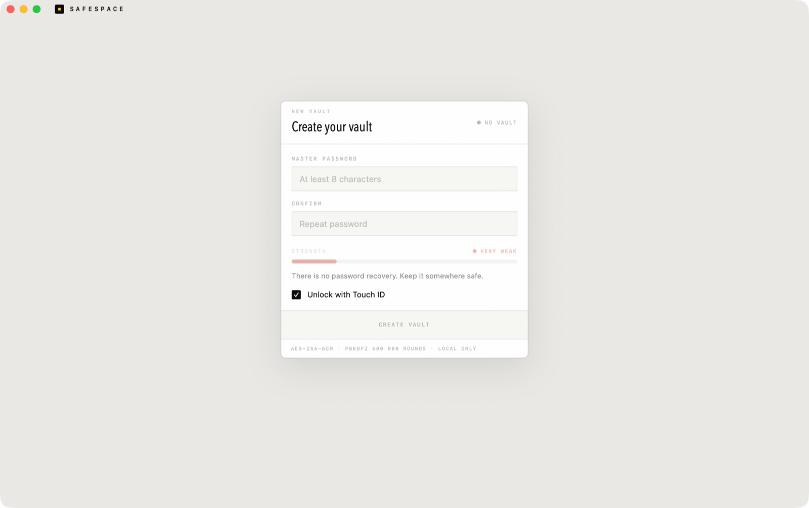

<div align="center">

# Safespace

**A private password manager for macOS and Windows.** Fully offline, AES-256 encrypted, with Touch ID
unlock on the Mac and a generator that actually gives you control.




</div>

## Why

Most password managers are a subscription and a sync service you have to trust. Safespace is one
encrypted file on your Mac, one app, and no accounts — with an interface worth looking at.

The interface is a desk of quiet paper widgets: your logins, the selected login with one-click
copy, a vault-health card that flags weak and reused passwords, and the generator.

## Features

- **Encrypted vault** — AES-256-GCM, key derived from your master password with PBKDF2-HMAC-SHA256
  (600,000 rounds, random 32-byte salt). Titles, usernames, URLs and notes are all inside the
  ciphertext.
- **Touch ID unlock** — the vault key is sealed to this Mac's Secure Enclave and released only after
  a fingerprint match. Your master password always works as a fallback.
- **Password generator with real options** — length 4–128, uppercase/lowercase/digits/symbols, your
  own symbol set, skip look-alike characters (`I l 1 O 0`), guarantee one of each selected set, plus
  a passphrase mode (word count, separator, capitalization, optional number) and a live
  strength/entropy readout.
- **Health at a glance** — filters and warnings for weak and reused passwords, and a vault-health
  line across the bottom.
- **Auto-lock** — after inactivity, when the Mac sleeps, and when the screen locks.
- **Clipboard safety** — copies clear on a timer (10s–2min), are marked concealed so clipboard
  managers skip them, and are wiped when you lock or quit.
- **Safe storage** — one file, mode `0600`, written atomically, previous version kept as `.bak`.
- **Offline by design** — no network code, no sync, no telemetry, no account.

## Screenshots

| Lock screen | Generator |
| --- | --- |
|  |  |

| Editor | First run |
| --- | --- |
|  |  |

The interface is monochrome and editorial: paper-white surfaces, hairline rules, square corners,
ultra-thin condensed headlines and tracked uppercase labels, with yellow and red as the only
accents. Dark mode ships with it — toggle it in the header or in Settings → General.

## Install

### Download

| Platform | Download | |
| --- | --- | --- |
| **macOS 14+** | **[Safespace.dmg](https://github.com/999david7/Safespace/releases/latest/download/Safespace.dmg)** | Open it and drag **Safespace** into **Applications**. |
| **Windows 10/11** | **[Safespace-Setup.exe](https://github.com/999david7/Safespace/releases/latest/download/Safespace-Setup.exe)** | Run it. Installs for your user, no admin needed. |
| Windows, portable | [Safespace-Portable.exe](https://github.com/999david7/Safespace/releases/latest/download/Safespace-Portable.exe) | Single file, no install. Needs WebView2 (built into Windows 11). |

Neither build is signed with a paid certificate yet. On Windows, SmartScreen may say *"Windows
protected your PC"*: click **More info → Run anyway**. For macOS, see below.

Both apps use the same vault format, so a `vault.dat` copied from a Mac opens on a PC and the other
way round. On Windows it lives in `%APPDATA%\Safespace\vault.dat`.

### Bringing an old vault along

- **New computer, or starting over:** on the *Create your vault* screen choose **Open an existing vault
  file…** and pick your `vault.dat` (or a `vault.safespace` from Safespace 1.0/1.1, or a `.bak`). It
  becomes your vault and opens with its own master password.
- **Already have a vault:** **Settings → General → Import logins** merges another vault file into the
  one you're using. You type that file's master password; logins you already have are kept and
  nothing is duplicated, even if you import the same file twice.

Updating from 1.0/1.1 needs nothing: the old `vault.safespace` is renamed to `vault.dat` on first launch.

**From the original SafeSpace** (the earlier C++ Windows app, whose binary `vault.dat` starts with
`SAFESPC`): both apps open it too, in either of the ways above. On a PC that still has it in
`%APPDATA%\SafeSpace\vault.dat`, just start Safespace and unlock with your old master password. The
first unlock converts it to the current format with the same password, keeps the original next to it
as `vault.dat.classic`, and turns its categories into groups.

### Build from source

**macOS** needs a Swift toolchain (Xcode or the Command Line Tools).

```bash
git clone https://github.com/999david7/Safespace.git Safespace-for-Mac
cd Safespace-for-Mac
scripts/build-app.sh --install     # builds and copies to /Applications
```

Leave off `--install` to get `build/Safespace.app` without touching `/Applications`, and run
`scripts/make-dmg.sh` afterwards to pack it into `build/Safespace.dmg`.

**Windows** needs [Node.js](https://nodejs.org) 20+ and [Rust](https://rustup.rs) (with the MSVC build
tools it asks for).

```powershell
cd windows
npm ci
npm run build      # installer in src-tauri\target\release\bundle\nsis\
```

The app is **ad-hoc signed, not notarized**, so Gatekeeper complains on first launch. Right-click the
app and choose **Open** once. On recent macOS versions you may instead have to allow it under
System Settings → Privacy & Security → **Open Anyway**.

## Usage

| Shortcut | Action |
| --- | --- |
| `⌘N` | New login |
| `⌘E` | Edit the selected login |
| `⌘F` | Focus search |
| `⇧⌘G` | Password generator |
| `⌘L` | Lock the vault |
| `⌘,` | Settings |

Settings covers auto-lock timing, clipboard clearing, appearance, Touch ID, and changing your master
password. **Settings → General → Show in Finder** reveals the vault file so you can back it up — it
stays encrypted wherever you copy it.

> [!WARNING]
> There is no password recovery. If you forget your master password, the data cannot be decrypted by
> anyone, including you.

## How it works

```
Sources/SafespaceCore/   crypto, storage, generator, strength estimation (UI-free, unit tested)
Sources/Safespace/       SwiftUI app: vault, detail/editor panels, generator, Touch ID, clipboard
Tests/                   Swift Testing suite for the core
Resources/               app icon (rendered by scripts/make-icon.py)
scripts/                 app bundling, DMG packing and icon rendering
windows/                 Safespace for Windows (Tauri): src/ is the UI and a JS port of the core
```

The vault file lives at `~/Library/Application Support/Safespace/vault.dat` and holds JSON
with `version`, `kdf`, `iterations`, `salt` and `ciphertext`. The ciphertext is an AES-GCM box
(nonce ‖ ciphertext ‖ tag); the header fields are authenticated as associated data, so they can't be
tampered with. Every save uses a fresh nonce, and changing the master password re-encrypts the vault
under a new salt.

Touch ID adds `touchid.enrollment` next to the vault: a Secure Enclave P-256 key created with
`.biometryCurrentSet`, plus the vault key sealed to it via ECDH → HKDF-SHA256 → AES-GCM. The enclave
refuses to use that key without a fingerprint, the file is useless on any other Mac, and adding or
removing fingerprints invalidates it (Safespace then turns Touch ID unlock off and asks for your
password). No Apple developer account or keychain entitlement needed.

**On Windows** the same format is produced with WebCrypto inside the app window (`windows/src/core.js`);
the derived key is created non-extractable and never leaves it. A test in the Swift suite opens a vault
written by the Windows app, so the two can't drift apart. The Windows app has no Touch ID equivalent yet
(Windows Hello unlock is a possible follow-up); it auto-locks after inactivity and when the PC sleeps, and
copies are excluded from Windows clipboard history and cloud clipboard.

See [SECURITY.md](SECURITY.md) for the threat model, including what this does **not** protect
against.

## Development

```bash
swift build      # build
swift test       # run the core tests
swift run        # run against your real vault
```

Preview any screen with sample data in a temporary vault, without touching your own (debug builds
only):

```bash
SAFESPACE_DEMO=vault swift run      # also: stage, generator, editor, locked, setup
```

<details>
<summary>Building with only the Command Line Tools installed</summary>

Recent Command Line Tools SDKs declare SwiftUI's `@State` as a macro whose plugin ships only with
Xcode, which breaks `swift build`. `scripts/build-app.sh` detects this and falls back to the newest
SDK that works. For plain `swift build` / `swift test`, set it yourself:

```bash
export SDKROOT=/Library/Developer/CommandLineTools/SDKs/MacOSX26.5.sdk
```

Run `swift build` before `swift test`, otherwise the test macros may fail to load.

</details>

Contributions welcome — see [CONTRIBUTING.md](CONTRIBUTING.md).

## Not included

No sync, no browser autofill, no import from other password managers, no sharing. Those need either a server or a browser
extension, and both are bigger trust decisions than this app currently asks you to make.

## License

[MIT](LICENSE) © 2026 David Winkler
